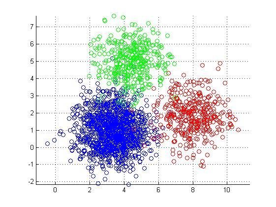

# 聚类模型：K-Means

- 聚类（clustering）属于无监督学习（unsupervised learning）

- 无类别标记

- 在线 demo：[http://syskall.com/kmeans.js](http://syskall.com/kmeans.js/)

## K-Means算法
- 数据挖掘十大经典算法之一

- 算法接收参数k；然后将样本点划分为k个聚类；同一聚类中的样本相似度较高；不同聚类中的样本相似度较小

## 算法思想：

以空间中k个样本点为中心进行聚类，对最靠近它们的样本点归类。通过迭 代的方法，逐步更新各聚类中心，直至达到最好的聚类效果

## 算法描述：

1. 选择k个聚类的初始中心
2. 在第n次迭代中，对任意一个样本点，求其到k个聚类中心的距离，将该 样本点归类到距离最小的中心所在的聚类 
3. 利用均值等方法更新各类的中心值 
4. 对所有的k个聚类中心，如果利用2,3步的迭代更新后，达到稳定，则迭代 结束。

## 优缺点：

- 优点：速度快，简单

- 缺点：最终结果和初始点的选择相关，容易陷入局部最优，需要给定k值